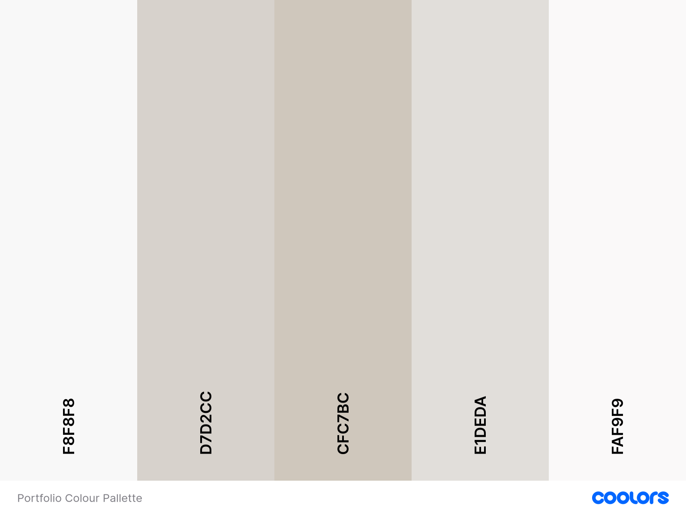

- Codepen for additional styling
- Canva - Logo for RMW to add to the main page and favicon icon tab.
- Link the rest of your completed projects to the page

Github Repo:
- https://github.com/rhiannawilson/RhiannaW-React-Portfolio

Netlify link:
https://rmw-netlify-deployment.netlify.app/

Colour pallette:
Seasalt light 1 - #FAF9F9
Seasalt light 2 - #F8F8F8
Timberwolf (lightest) - #E1DEDA
Timberwolf (medium) - #D7D2CC
Timberwolf (darkest) - #CFC7BC

>

To Do:

1. About Me
Brief Introduction: Share who you are, your background, and your journey to becoming a software engineer.
Personal Story: Mention your experience managing office moves and staff, and how that connects to your skills in project management and software engineering.
Hobbies & Interests: Include your interests like languages, music, photography, cooking, or baking to give a personal touch.

2. Skills Section
Technical Skills: Showcase your expertise in full-stack engineering, languages (JavaScript, SQL, etc.), frameworks (React, Apollo, Handlebars.js), and tools (Webpack, Vite, etc.).
Design Knowledge: Highlight your awareness of design trends and experience with color palettes, CSS loaders, and responsive design.

3. Projects
CMSify: Include details on your CMS project, showcasing TDD, Promises, and templating engines like Handlebars.js.
Social Network API: Describe the backend and API work you've done, focusing on the functionality.
React Portfolio: Display your work on the React portfolio project and how it helps employers assess candidates.
Skill Swap Application: Explain how your skill swap website is designed to connect people based on various skills like baking, photography, etc.

For each project, provide:

A brief description.
Tech stack used (e.g., React, Node.js, SQL).
Live demo links (if available).
GitHub repository links.

4. Blog or Articles
Write about your learning process, experiences with frameworks like Apollo and Vite, overcoming challenges in software development, or career transition into tech.

5. Contact Information
Include a simple contact form or email for potential employers to reach you.

6. Resume Download
Offer a downloadable version of your resume.